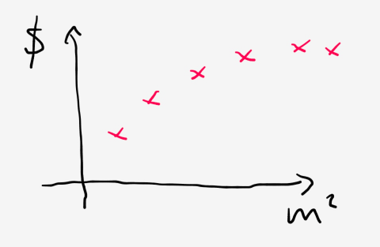
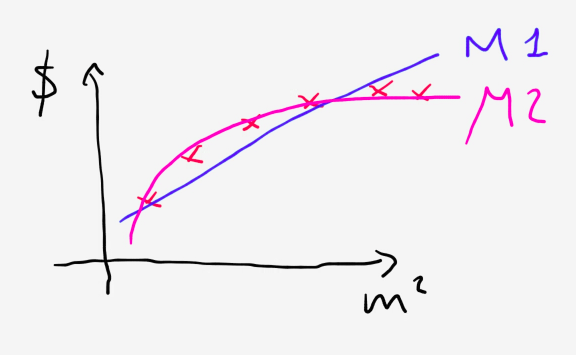
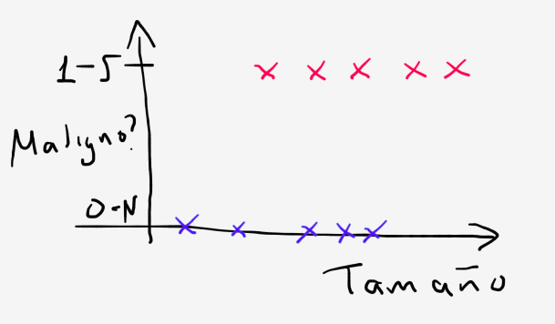
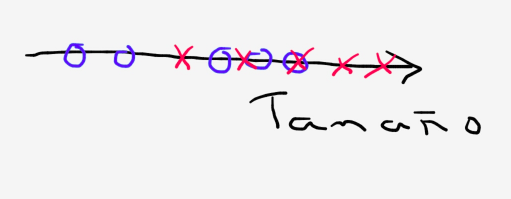
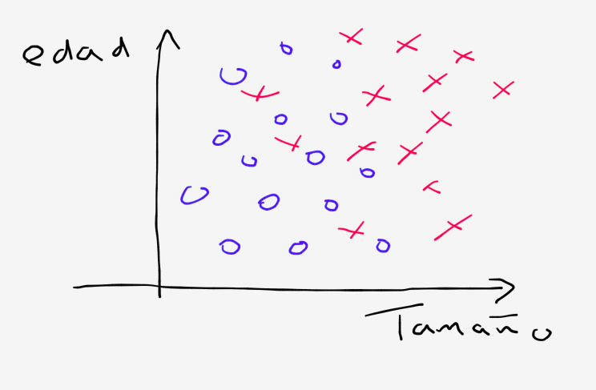
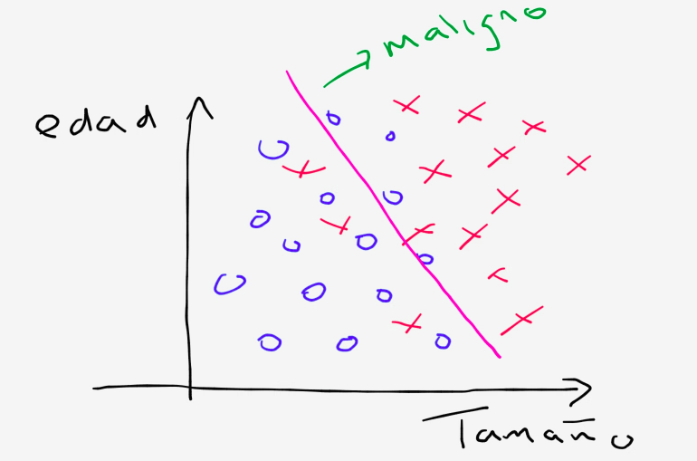
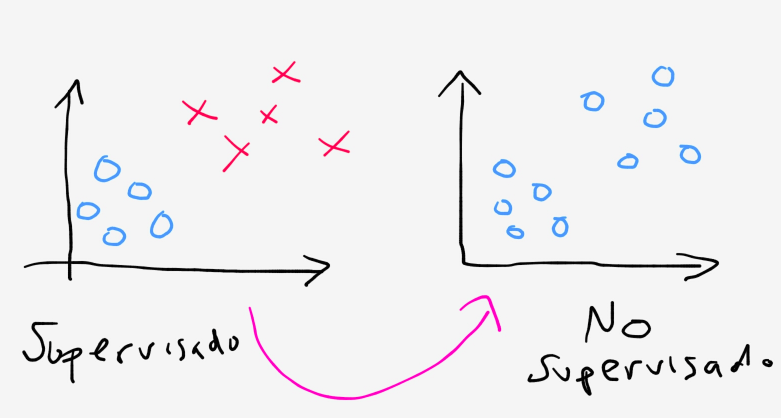
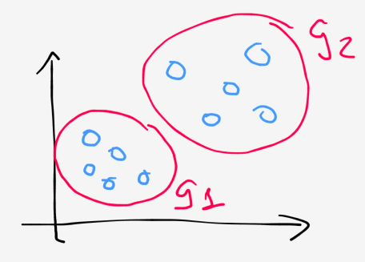

```{r setup, include=FALSE}
knitr::opts_chunk$set(echo = T, error = F, message = F, warning = F)
library(readr)
library(ggplot2)
```


# ¿Qué es aprendizaje?

## Ventas de productos

Supongamos que un cliente te pide ayuda para mejorar las ventas de determinados 
productos. Dado que no es posible mejorar las ventas en forma directa, 
debemos buscar variables que podamos mover de manera que -en forma indirecta-
el cliente sea capaz de incrementar sus ventas.

Si determinamos, por ejemplo, que la asociación entre las variables del
gasto en anuncios de los productos y las ventas es positiva, podemos recomendar
en qué medida se debe de aumentar el presupuesto de marketing de los diferentes
productos.

### Ejercicio

Usaremos la base de datos `Advertising` en el paquete `ISLR`.

La base contiene las ventas de un producto en 200 mercados distintos, así 
como el presupuesto de marketing para tres tipos de medio.

Utiliza `ggplot2` para graficar en el eje x el presupuesto y en el eje y las 
ventas. Realiza esto para los diferentes tipos de medio (TV, radio, periódico).

Superpon en la gráfica la recta de regresión por cada tipo de medio.

###

```{r, eval = F}
# Respuesta
library(readr)
library(ggplot2)
data <- read_csv("http://www-bcf.usc.edu/~gareth/ISL/Advertising.csv")
names(data) <- tolower(names(data))

dat.g <- data %>%
  tidyr::gather(key = medio, value = marketing.budget, -x1, -sales)

ggplot(dat.g, aes(x = marketing.budget, y = sales)) + geom_point() +
  facet_wrap(~medio) +
  geom_smooth(method = 'lm', formula = y ~ x)

ggplot(dat.g, aes(x = marketing.budget, y = sales)) + geom_point() +
  facet_wrap(~medio, scales = "free") +
  geom_smooth(method = 'lm', formula = y ~ x)

ggplot(dat.g, aes(x = marketing.budget, y = sales, group = medio, color = medio)) + geom_point() +
  geom_smooth(method = 'lm', formula = y ~ x) 

```

# La función a estimar

Supongamos que observamos la respuesta (cuantitativa) $Y$ y $p$ predictores
$ X_1, X_2, ..., X_p$. Suponemos también que hay una relación entre Y y **X**
tal que se pueden escribir como 

\[
Y = f(x) + \epsilon
\]

$f$ es fija pero es desconocida y es una función de las variables $X_1, X_2, ..., X_p$.
$\epsilon$ es un error aleatorio, es independiente de **X** y tiene media cero.
En esta formulación, $f$ representa la información sistemática (la que podemos
aislar con un modelo) que **X** provee acerca de Y.


Si vemos el gráfico siguiente, podemos ver que para 30 individuos en una
muestra aleatoria, la escolaridad de la persona parece estar muy relacionada con 
su ingreso.

```{r}
library(ggplot2)
data <- read_csv("http://www-bcf.usc.edu/~gareth/ISL/Income1.csv")

ggplot(data = data, aes(y = Income, x = Education)) + 
  geom_point()

```

Podemos modelar la relación que existe entre el ingreso y la escolaridad 
de manera que, a partir de conocer la escolaridad de alguien nuevo, podamos
predecir su ingreso. $f$ dependerá de qué tipo de asociación *suponemos*
existe entre las variables independientes y la variable dependiente.

El *aprendizaje estadístico* refiere al conjunto de métodos que tenemos a nuestra
disposición para estimar $f$.

Llamaremos a las variables independientes de muchas maneras: features, predictores.
A la variable dependiente también la llamaremos variable de respuesta.

# El objetivo (del analista) para determinar f

Hay dos razones principales para querer estimar $f$: para predecir o para
realizar inferencias.

## Predicción

En muchas situaciones, tenemos muchas variables independientes posibles pero
la variable dependiente no es fácilmente obtenible. De la formulación realizada
antes, sabemos que el error promedio es cero y, por ende, podemos
predecir Y usando

$\hat{Y} = \hat{f}(\boldsymbol{X})$

donde $\hat{f}$ representa nuestra estimación para $f$ y $\hat{Y}$ representa
el resultado de nuestra predicción para $Y$.

En este escenario, $\hat{f}$ es normalmente tratada como una caja negra pues
no nos interesa tanto conocer su forma exacta si no, más bien, proveer 
predicciones lo más certeras posibles (accurate).

**Ejemplo** Supongamos que dadas varias mediciones de las características de
la sangre de un paciente, queremos predecir las probabilidad de que alguien
tenga una reacción adversa al utilizar una medicina. Vamos a querer utilizar esas 
características de la sangre (**X**) para predecir la probabilidad de una reacción
indeseada (Y) de manera que no le demos esa medicina a gente que puede 
tener una reacción adversa. 

Queremos entonces el modelo que nos de las predicciones más precisas posibles. 
Esto entonces será nuestra medida de calidad del modelo: cuánto podemos reducir 
el error.

## Tipos de errores

Podemos dividir el error en dos: el reducible y el irreducible. En general,
$\hat{f}$ no nos dará un estimador perfecto para $f$ y esta inexactitud 
introducirá un error en nuestras predicciones.

El error reducible se encuentra en la forma que *elegimos* para modelar $f$.
Para ser capaces de estimar $f$ debemos de asumir algunas cosas con 
respecto a ella de manera que podamos producir $\hat{f}$. Por ejemplo, 
en regresión estamos suponiendo que $f$ es lineal (entre otras cosas).

La precisión dependerá de cuán acertada fue nuestra elección de $\hat{f}$.

Aunque eligamos la $\hat{f}$ más apropiada, aún podemos tener un error. ESto es
porque $f$ es una función también de un $\epsilon$. Esto es lo que 
conocemos como error irreducible. Sin importar cuán bien eligamos $\hat{f}$,
es el error que nos queda.

Ese error puede contener variables que no medimos o que no tenemos guardadas que
hubieran sido útiles para la predicción. El error también puede contener
variación no medible. Por ejemplo, el efecto adverso puede ser resultado de
alguna caracterísitca temporal del paciente en cuestión o del proceso de 
manufactura de la medicina.

En general, usando el modelo $\hat{Y} = \hat{f}(\boldsymbol{X})$ reescribimos
su error como:

\[
E(Y - \hat{Y})^2 = E[f(X) + \epsilon - \hat{f}(X)]^2 = [f(X) - \hat{f}(X)]^2 + Var(\epsilon)
\]

donde $E(Y - \hat{Y})^2$ representa el promedio o valor esperado de la suma de la diferencia entre el valor
predicho y el valor real de $Y$ y $Var(\epsilon)$ representa la varianza asociada
al término de error $\epsilon$.

$[f(X) - \hat{f}(X)]^2$ es el **error reducible** pues depende únicamente de
nuestra representación de $f$.

$Var(\epsilon)$ el el **error irreducible** y provee de una cota a la precisión
de los modelos que utilicemos para estimar $f$. Esta cota siempre es desconocida 
en la práctica. 

Las técnicas que se estudiarán permitirán estimar $f$ de forma que se minimice
el error reducible. 

## Inferencia

El segundo motivo para estimar $f$ tiene que ver con el deseo de entender
la forma en la que $Y$ es afecada por cambios en cualesquiera de las $X_1, ..., X_p$.

En este caso queremos estimar $f$ pero nuestro objetivo no es necesariamente
hacer una predicción para $Y$ si no entender la relación que guardan las
variables independientes (individualmente y en conjunto) con la variable
dependiente. 

No podemos entonces tratar a $f$ como una caja negra pues necesitamos conocer
la *forma* de $f$.

De esta forma, podemos contestar preguntas como:

- ¿Cuáles predictores están asociados con la respuesta?
- ¿Cuáles de estas relaciones son más importantes?
- ¿Cuál es la relación que guarda la variable respuesta con cada uno de los
predictores?
- ¿Podemos reducir la relación que guarda la dependiente con las independientes 
a una forma lineal o su relación es más compleja?

**Ejemplo**: Si modelamos qué marca puede comprar un consumidor basándonos en 
variables como el precio, la localización geográfica de la tienda, los descuentos,
el precio de los bienes de la competencia, entre otras, podríamos responder
preguntas como:

- ¿En qué tiendas deberíamos poner descuentos para poder posicionar la marca?
- ¿Qué efecto podemos esperar de un cambio de precio en determinado producto?
- ¿En que lugares un descuento no tiene un efecto en las ventas?

### Ejercicio {#ejercicio}

Propon preguntas que puedes responder utilizando la base de Advertising que tengan
como objetivo entender la relación entre las variables y las ventas.

## Predicción e inferencia

Éstos dos objetivos afectan la forma en la que modelamos pues afecta cómo evaluamos
a los modelos. Sin embargo, son objetivos que -con los mismos datos- podemos
buscar al mismo tiempo dependiendo del problema a analizar.

Es importante por ejemplo predecir el valor de las casas en determinadas zonas
para saber en dónde es conveniente invertir.

Si, en cambio, voy a vender mi casa me interesa saber cuánto más puedo cobrar
por ella dado que mi casa tiene una linda vista.

Dependiendo del objetivo del modelo me conviene utilizar distintos métodos
para estimar $f$. Los modelos lineales, por ejemplo, son de fácil interpretación
pero no necesariamente me ayudan a predecir. A su vez, un buen modelo 
predictivo no necesariamente tiene sentido para entender las relaciones que
guardan las variables.

# ¿Cómo estimamos f?

Hay métodos lineales y no lineales para estimar $f$. Los métodos tienen
ciertas características compartidas.

Por ahora, suponemos que tenemos un conjunto de $n$ observaciones. A estas
observaciones las llamamos el conjunto de entrenamiento pues las utilizaremos
para *entrenar* o enseñar al método cómo estimar $f$. Usando la notación
señalada con anterioridad, nuestro conjunto de entrenamiento consiste de 
${(x_1, y_1), ..., (x_n, y_n)}$ donde $x_i = (x_{i1}, ..., x_{ip})$

La aplicación de un método específico usando el conjunto de entrenamiento nos
dará un estimador para $\hat{f}$. Los métodos usados los podemos caracterizar
ya sea como paramétricos o no paramétricos.

## Paramétricos

Los métodos paramétricos involucran un modelado en dos pasos.

1. Primero, realizamos un supuesto acerca de la forma que tiene $f$. POr ejemplo,
podemos suponer que $f$ es lineal con respecto a **X**.

\[
f(X) = \beta_0 + \beta_1 X_1 + \beta_2 X_2 + ... + \beta_p X_p
\]

Con ese supuesto, el problema se reduce a estimar los valores de las $\beta$s
o $p + 1$ *coeficientes* $\beta_0, ..., \beta_p$.

2. Después de que seleccionamos el modelo, se necesita un procedimiento que 
utilice los datos para entrenar un modelo. Es decir, queremos encontrar
los valores de los parámetros tal que 

\[
Y \approx \beta_0 + \beta_1 X_1 + \beta_2 X_2 + ... + \beta_p X_p
\]

El método más común para realizar esto se conoce como método de mínimos cuadrados.
Hay muchas otras maneras de estimar esos parámetros.

El acercamiento basado en modelos se conoce como paramétrico y reduce el problema
a estimar una serie de parámetros que describen a $f$ en conjunto con **X**.

La desventaja es que esto supone que el modelo elegido es correcto para representar
$f$. Si elegimos mal, todas nuestras conclusiones serán malas.

Para tratar de limitar ese problema, podemos utilizar muchas formas de $f$ y 
ver cuál ajusta mejor los datos. Esto requiere estimar un mayor número de 
parámetros y pueden generar además un problema de *overfitting*.

*Overfitting* sucede cuando nuestro modelo sigue demasiado a los datos que
nos da errores muy pequeños para los datos que tenemos pero no necesariamente
nos dara un modelo muy bueno para datos nuevos.

### Ejercicio {#ejercicio}

1. Utiliza los datos de ingreso (traelos a tu ambiente de R con el comando de abajo).
2. Grafica el ingreso contra las otras variables.
3. Utiliza la función `lm` para ajustar un modelo de regresión en donde la dependiente
sea el ingreso y las variables independientes sean la escolaridad y la 
antigüedad.
4. ¿Cuáles son los valores de las betas?

```{r, eval = F}
# 1
data <- read_csv("http://www-bcf.usc.edu/~gareth/ISL/Income2.csv")
names(data) <- tolower(names(data))

# 2
dat.g <- data %>%
  tidyr::gather(key = variable, value = valor, -x1, -income)

ggplot(dat.g, aes(x = valor, y = income, group = variable, colour = variable)) + geom_point() +
  geom_smooth(method = "lm") +
  theme_bw()

# 3
mod <- lm(formula = income ~ education + seniority, data = data)

# 4
mod$coefficients
```

## No paramétricos

Un método no paramétrico no hace un supuesto explicito acerca de la forma
de $f$ y trata de estimar la $f$ que más se aproxima a los datos.

La ventaja es que no es posible equivocarse en la elección de la forma de $f$ 
pues el método dará la forma más correcta para las observaciones que recibe.

La gran desventaja es que el problema no se reduce y normalmente requieren 
de una enorme cantidad de datos de manera que se obtenga una $f$ precisa.

Los splines, por ejemplo, no suponen una forma para $f$.

# Precisión e interpretabilidad

Existe un *trade-off* entre la flexibilidad de un modelo (lo que nos da su 
precisión) y la interpretabilidad.

MIentras menos flexible (o más restrictivo) es un método, menos formas distintas
de $f$ podemos producir con éste. La regresión lineal, por ejemplo, es un
acercamiento bastante inflexible pues solamente permite generar funciones
lineales. 
Otros métodos son más flexibles pues permiten generar muchas formas para $f$. Si
rankearamos los algoritmos según su flexibilidad (donde más es más flexible)
tendríamos una escala como esta:

\[
lasso << ols << additive models << bagging / boosting << svm
\]

¿Por qué elegiríamos una opción menos flexible?

Cuando nuestro propósito es la inferencia, un acercamiento más restrictivo en
general suele ser más interpretable. Si elegimos un método muy flexible es 
a veces imposible decifrar la forma en la que los predictores están asociados
con la variable de interés.

Cuando nuestro interés es predictivo únicamente, no nos importa la forma de $f$
mientras que tengamos una alta precisión. Sin embargo, aún en estos casos puede
pasar que un modelo inflexible nos de mejores resultados. ESto es una 
consecuencia directa del problema de overfitting que suele ser más alto 
cuando tenemos modelos flexibles.

# Supervisado vs. no supervisado
## Aprendizaje supervisado

## Precios de casas



### Ejercicio {#ejercicio}


¿Qué función me permite predecir el precio en el que un amigo puede vender 
su casa?
¿Cuál es M (medida), cuál es E (experiencia) y cuál es T (tarea)?

###

Hay varias posibilidades.



M1 es, por ejemplo, la recta que extraemos de un modelo de regresión que trata
de predecir una variable continua.

M2 puede ser un spline de segundo grado.

Le dimos al algoritmo una base de datos con las *respuestas correctas* y
el algoritmo busca dar más de las respuestas correctas.

## Cancer de mama

Ahora el problema que tenemos es ¿cuál es la probabilidad de que un tumor
sea maligno?


Tenemos ahora un problema de clasificación, en este caso de dos valores
posibles: maligno (1) y benigno (0).

Un problema de clasificación puede tener más de 2 valores.

Dado que tenemos una única variable para predecir, podemos representarlo de la
siguiente manera.



Ahora, supongamos que también contamos con la edad de los pacientes. Lo podemos
representar gráficamente como:



Un algoritmo de ML buscará separar lo más posible los casos malignos de los 
benignos como sigue:



Podemos usar tantos atributos o features como queramos, por ejemplo, 
la historia familiar, la uniformidad del tamaño de las células del tumor, etc.
La idea será mejorar la capacidad de predecir si el tumor es maligno o 
benigno (M - medida) al darle muchos casos de pacientes con cancer (E - experiencia)
al darle la tarea de predecir nuevos pacientes (T - tarea).

## Aprendizaje no supervisado

En algunas aplicaciones, no tenemos la *respuesta correcta* para la pregunta
que queremos realizar.



No nos dicen qué tipo de observación tenemos y, más bien, la pregunta
se transforma en si podemos o no encontrar una estructura a los datos que tenemos.

Por ejemplo, ¿podemos encontrar grupos distinguibles en los datos?



Un método comunmente utilizado para esta tarea es el método de k-medias.

**Ejemplo** [Google News](news.google.com)

Todos los días google news analiza millones de noticias y las agrupa en *historias*
en donde te aparecen varias noticias que hablan del mismo tema.

**Ejemplo**

Cuántos genes expresan específicos genes. Así, se puede agrupar a los individuos
entre diferentes tipos. 

Otros ejemplos:

- Organizar clusters computacionales
- Análisis de redes sociales: podemos formar grupos en donde todos se conocen.
- Segmentación de mercados: podemos descubrir segmentos de mercado de manera 
que podamos vender productos o realizar estrategias de marketing.
- Análisis de datos astronómicos: para formular teorías de cómo se forman las
galaxias.
- Cocktail party problem: en una fiesta, dos personas quieren hablar pero 
es dificil escucharse. El algoritmo del problema separa las voces de 
los diferentes *speakers* en forma nítida al combinar múltiples grabaciones de 
micrófonos posicionados en diferentes lugares.

Aunque parece complicado, hay algoritmos ya implementados que permiten lograr
muy buenos resultados con pocas líneas de código.


# Regresión vs. clasificación

Las variables en general las dividimos en:

- Cuantitativas: la variable toma valores reales
- Cualitativas (categóricas): la variable toma valores discretos

Es normal referirse a los problemas con una variable respuesta cuantitativa
como problemas de regresión.

A su vez, nos referimos a problemas con una variable respuesta discreta como
problemas de clasificación.

Por ejemplo, la regresión lineal lidea con problemas de regresión y la regresión
logística con problemas de clasificación. Hay métodos, como el boosting o k-vecinos
cercanos que pueden lidear con ambos.

Para la mayoría de los métodos, no importa que las variables independientes sean
de cualquiera de los dos tipos *siempre que* estén apropiadamente codificadas.
En R, eso significa que se declaren como factor o caracter.

# Evaluación de la precisión del modelo

Si pruebo varios modelos, ¿cómo puedo distinguir cuál es *mejor*?

Uno de los problemas del aprendizaje es que no existe un modelo que es superior
a todos para todos los conjuntos de datos posibles. *No free lunch*. 

Decidir qué método es mejor dados mis datos es una tarea importante para obtener
mejores resultados.

Seleccionar el mejor método dados mis datos es uno de los problemas más difíciles
de solucionar.

## Medir la bondad de ajuste

Para evaluar cuán bien se desempeña un método en determinado conjunto de datos,
necesitamos una medida de cuán bien nuestras predicciones se acercan a las
predicciones que obtenemos. Es decir, mediremos el error de predicción de alguna
forma.

En regresión, por ejemplo, la medida más común es el error cuadrático medio (MSE)
que está dado por 

\[
MSE = \frac{1}{n}\sum_{i=1}^{n}(y_i - \hat{f}(x_i))^2
\]

donde $\hat{f}(x_i)$ es la predicción que da $\hat{f}$ para la i-ésima observación.

El MSE será pequeño cuando mis predicciones sean cercanas al verdadero valor 
de $y$. Esta medida se calcula utilizando los datos de entrenamiento.

Sin embargo, en general no nos interesa cuán bien se desempeña el modelo en este
conjunto de datos. El método estaba diseñado para minimizar esa medida del error
con los datos que tenía.

Lo que nos va a importar es la precisión de las predicciones cuando le aplicamos
el modelo a datos que no habíamos visto antes, es decir, lo que llamamos el
*conjunto de prueba*.

El procedimiento estándar entonces es:

1. Recibo mis datos y *sin tocarlos* separo los datos en dos subconjuntos: uno 
de entrenamiento y otro de prueba.
    - El conjunto de prueba no hay que usarlos para nada!! Ni siquiera para normalizar. Nada, solo probar al final
    - El conjunto de entrenamiento puede a su vez contener un conjunto de validación
    - El conjunto de entrenamiento (sin el de validación) se usa para ajustar el modelo.
    - El conjunto de validación sirve para comparar diferentes parámetros del modelo (para los que los tienen). Por ejemplo queremos decidir entre si ponerle 4 u 8 neuronas a la capa intermedia de una RN
    - La extracción del conjunto de validación se hace por cada experimento (validación cruzada )
    - La regla de dedo es 75% para entrenamiento y 25% para pruebas pero puedes usar
70-30 o 90-10.
2. Ajusta tus datos con distintos métodos o utilizando el mismo método pero 
con distintas especificaciones del modelo.
3. Elegimos una medida de precisión (en el ejemplo de regresión, puede ser MSE)
4. Escoger entonces el método o modelo que me da la menor medida del error en 
los datos de prueba.

Más adelante veremos métodos más específicos para realizar esta y otras tareas.
De esta forma iremos extendiendo el procedimiento de modelado de manera que 
nos aseguremos que tenemos buenos resultados.

Pregunta: ¿Cómo extiendo esto a métodos no supervisados?

### Ejercicio

Vuelve a utlizar los datos de salario y realiza el procedimiento descrito arriba:

1. Divide tus datos en un conjunto de entrenamiento y de prueba (entrenamiento asigna el 70% de tus observaciones y a prueba el 30%.
2. Ajusta varias especificaciones del modelo de regresión para predecir ingreso usando 
como independiente un modelo con escolaridad, otro con antiguedad, otro con las dos. ¿Qué otras especificaciones puedes probar?
3. Elige como medida de precisión MSE.
4. Escoge el método que menor medida del error tiene en los datos de prueba.

```{r, eval = F}
# 1
data <- read_csv("http://www-bcf.usc.edu/~gareth/ISL/Income2.csv")
names(data) <- tolower(names(data))
N <- floor(0.7 * nrow(data))
data$id <- seq(nrow(data)) 
set.seed(281187)
indices_entrena <- sample(data$id, size = N, replace = F)
entrenamiento <- filter(data, id %in% indices_entrena)
prueba <- filter(data, !(id %in% indices_entrena))

nrow(entrenamiento) + nrow(prueba) == nrow(data)
nrow(entrenamiento)
nrow(prueba)

# 2
mod1 <- lm(formula = income ~ education, data = entrenamiento)
mod2 <- lm(formula = income ~ seniority, data = entrenamiento)
mod3 <- lm(formula = income ~ education + seniority, data = entrenamiento)

# mse en PRUEBA
mse <- function(modelo, datos.prueba) {
  # Hago la prediccion para los nuevos datos
  datos.prueba$prediccion <- predict(modelo, newdata = datos.prueba)
  # Calculo el residual
  datos.prueba$residual <- datos.prueba$income - datos.prueba$prediccion
  # regreso el MSE
  sqrt(mean(datos.prueba$residual^2))
}

mses <- sapply(list("mod1" = mod1, "mod2" = mod2, "mod3" = mod3), FUN = function(m){ mse(m, prueba)})

names(mses)[match(min(mses), mses)]
```


# Trade-off entre sesgo y varianza

En general, cuando modelamos observamos lo siguiente:


La U que se forma habla de dos propiedades en conflicto al utilizar métodos
estadísticos. Puede probarse que el MSE esperado en el conjunto de prueba,
para un valor dado $x_0$ siempre se puede descomponer en la suma de tres cantidades:

- La varianza de $\hat{f}(x_0)$
- El sesgo al cuadrado de $\hat{f}(x_0)$
- La varianza del error ($\epsilon$)

\[
MSE_{prueba} = E(y_0 - \hat{f}(x_0))^3 = Var(\hat{f}(x_0)) + [sesgo(\hat{f}(x_0))]^2 + Var(\epsilon)
\]

donde $MSE_{prueba}$ se refiere a la medida del error en el conjunto de prueba. 
En realidad, es el promedio de los errores en el conjunto de prueba si repetimos
la estimación de $f$ utilizando varios conjuntos de prueba y validamos con $x_0$.

Para tener una medida global del MSE podemos promediar todas las medidas obtenidas.

De la ecuación se deduce qeu para minimizar el error en el conjunto de prueba,
debemos seleccionar el método que consigue -al mismo tiempo- una varianza baja
y un sesgo bajo.

La varianza del método se refiere a cuánto cambia $\hat{f}$ si la estimamos 
con distintos conjuntos de entrenamiento. Como $\hat{f}$ depende de **X**,
obtendremos distintas $\hat{f}$ para distintos conjuntos. En general, mientras
más flexible es el método, más varianza hay pues siguen más a los datos con los 
que se entrena.

El sesgo del método se refiere al error que se introduce al aproximar un problema.
Por ejemplo, la regresión lineal tiene como supuesto que la relación entre Y y 
**X** es lineal. Esto es muy poco probable en un problema real (es una 
simplificación atrevida). Por lo tanto, nos alejaremos del verdadero valor de $f$. 
Al usar métodos más flexibles el sesgo disminuye.

Entonces, si aumento flexibilidad disminuyo el sesgo y aumento la varianza: a 
esto nos referimos con un *trade-off* entre sesgo y varianza. 

Dado que el objetivo es tener menos error y éste es la suma de ambos, debe existir
un nivel de flexibilidad que me da un error de prueba mínimo. 

Por esto es que no necesariamente un método flexible le gana siempre a uno rígido.

