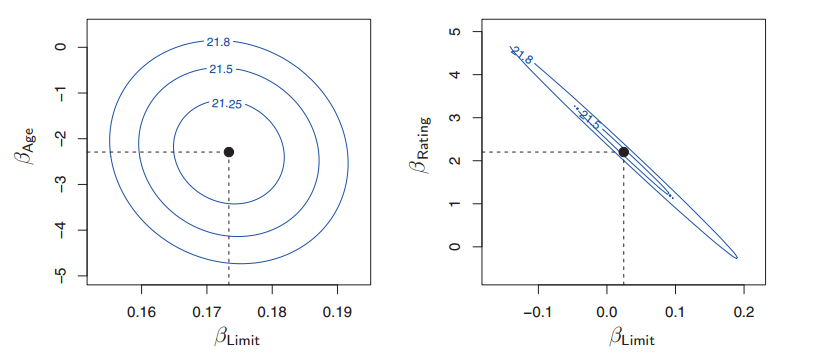

```{r setup, include=FALSE}
knitr::opts_chunk$set(echo = T, error = F, message = F, warning = F)
library(readr)
library(ggplot2)
library(tidyr)
library(dplyr)
library(ISLR)
library(foreign)
```

La regresión lineal es un método sencillo del aprendizaje supervisado y permite
predecir una variable respuesta cuantitativa. 

Su origen data de hace un par de siglos y es un método muy comunmente utilizado.
Su entendimiento es importante por varias razones:

- Muchos métodos de aprendizaje pueden ser vistos como extensiones de la regresión
lineal.
- Normalmente provee de un `baseline` sencillo para otros modelos.
- Su uso extendido implica también que muchos de los usuarios que tenemos 
para los modelos lo entiendan y puedan comprender su utilidad y resultados.

Del ejemplo de `Advertising` que ya trabajamos en la sección anterior, al 
utilizar una regresión simple podemos responder preguntas como:

- ¿Existe una relación entre el presupuesto de marketing y las ventas?
- ¿Cuán fuerte es la relación (si existe)?
- ¿Qué tipo de medio contribuye más a las ventas?
- ¿Cuán precisamente podemos estimar el efecto de cada uno de los tipos de medios 
sobre las ventas?
- ¿Cuán precisamente podemos predecir las ventas futuras?
- ¿La relación es lineal?
- ¿Hay complementariedad entre los tipos de medio?

# Regresión lineal simple

Una regresión lineal simple predice una variable respuesta $Y$ utilizando una
única variable independiente $X$. El supuesto implícito es qeue la relación
que guardan $X$ y $Y$ es aproximadamente lineal y el modelo que se supone (la
forma de la $f$) es:

\[
Y \approx \beta_0 + \beta_1 X
\]

Si consideramos la base de datos de `Advertising`, podemos especificar un
modelo de regresión lineal simple como sigue:

\[
ventas \approx \beta_0 + \beta_1 TV
\]

donde $\beta_0$ representa la ordenada al origen y $\beta_1$ es la pendiente 
del modelo linea. Estos dos números se conocen como *coeficientes* o *parámetros*.

Utilizamos los datos de la base `Advertising` para entrenar un modelo, es decir,
para calcular $\hat{\beta_0}$ y $\hat{\beta_1}$ del modelo especificado. A su vez,
una vez que calculamos estos dos parámetros podremos calcular una predicción de
$Y$, a la que denotamos como $\hat{y}$ basandonos en que $X = x$.

## Estimación de los coeficientes

Como $\beta_0$ y $\beta_1$ son desconocidos y debemos estimarlos. Para eso utilizamos
las $n$ parejas ordenadas que nos dan nuestros datos, es decir:

\[
(x_1, y_1), (x_2, y_2), ..., (x_n, y_n)
\]

En el ejemplo de `Advertising`, queremos unos estimadores de $\hat{\beta_0}$ y 
$\hat{\beta_1}$ tales que la línea resultante sea la más cercana posible a los
$n$ (200) observaciones en la base.

Hay muchas maneras de definir esa cercanía, la más común es el criterio de mínimos 
cuadrados. Lo que se hace es minimizar la distancia entre los puntos y la recta
al cuadrado, es decir, si vemos la figura siguiente, el error en la 
observación i-ésima está dado por la línea gris para cada observación $(x_i, y_i)$.
Ésta última son los puntos rojos (en este caso, 200).

Una vez estimados los coeficientes, tenemos $\hat{y_i} = \hat{\beta_0} + \hat{\beta_1} x_i$. 
$\hat{y_i}$ esta sobre la recta azul.

El residual i-ésimo es la diferencia entre la observación i-ésima para la variable
dependiente ($y_i$) y la i-ésima estimación según el modelo ($\hat{y_i}$).
Es decir, $e_i = y_i - \hat{y_i}$.

```{r}
data <- read_csv("http://www-bcf.usc.edu/~gareth/ISL/Advertising.csv")
names(data) <- tolower(names(data))

m <- lm(sales ~ tv, data = data)
data$fitted <- m$fitted.values
data$residual <- m$residuals

ggplot(data = data, aes(x = tv, y = sales)) + geom_point(color = "red") +
  geom_line(aes(y = fitted), color = "blue") +
  geom_segment(aes(x = tv, xend = tv, y = sales, yend = fitted, color="Distancia"), color = "grey80") +
  labs(xlab = "Presupuesto para TV", ylab = "Ventas") + 
  theme_bw()
```

Se define la suma de cuadrados del error (SCE) como:

\[
SCE = e_1^2 + e_2^2 + ... + e_n^2
\]

La estimación por mínimos cuadrados elige $\hat{\beta_0}$ y 
$\hat{\beta_1}$ que minimizan la $SCE$. Puede probarse que estos son:

\[
\hat{\beta_1} = \frac{\sum_{1=1}^n(x_i - \overline{x})(y_i - \overline{y})}{\sum_{i=1}^{n}(x_i - \overline{x})^2}
\]
\[
\hat{\beta_0} = \overline{y} - \hat{\beta_1}\overline{x}
\]

donde $\overline{y} \equiv \frac{1}{n} \sum_{i=1}^n y_i$ y
$\overline{x} \equiv \frac{1}{n} \sum_{i=1}^n x_i$ son las medias muestrales.

La recta azul de la figura anterior es la recta de la regresión lineal simple 
estimada por mínimos cuadrados. En este caso, la ordenada es $\hat{\beta_0} =$
`r round(unname(m$coefficients[1]), 2)` y la pendiente es $\hat{\beta_1} =$
`r round(unname(m$coefficients[2]), 2)`.

La *interpretación* es directa: por cada $1,000 adicionales gastados en campañas
de televisión, se venden `r round(1000*m$coefficients[2], 2)` unidades
adicionales del producto ($1,000 * \beta_1$).

## Evaluación de la precisión de los estimadores de los coeficientes

Recordamos que siempre partimos del modelo:

\[
Y = f(X) + \epsilon
\]

En regresión lineal simple, *suponemos* que podemos aproximar $f$ a través de una
función lineal y, por lo tanto, escribimos la relación 

\[
Y = f(X) + \epsilon = \beta_0 + \beta_1 X + \epsilon
\]

Igual que en cualquier otra recta, la ordenada es el valor de la función cuando
$X=0$ y la pendiente es el cambio esperado en $Y$ que podemos asociarle a una
unidad adicional de $X$. La $\epsilon$ simplemente toma todo lo que no pudimos
modelar utilizando la información de $X$. 

El término del error, entonces, contiene:

i. Si la relación no era lineal, lo que no atrapamos por nuestro supuesto sobre $f$
ii. Si la especificación de $X$ no fue completa, atrapa la relación que otras 
variables independientes tienen sobre $Y$.
iii. Errores de medición 

Ahora bien, construyamos un ejemplo donde el error del tipo i y ii no son posibles
pues *sabemos* que la relación entre $X$ y $Y$ es lineal y conocemos los 
coeficientes *verdaderos*. Es decir, generaremos datos utilizando la función
[@isl, p. 64]:

\[
Y = 2 + 3X + \epsilon
\]

Esta relación *verdadera* nos da la **recta de regresión de la población**. 
Normalmente, no la conocemos. Ahora, con datos simulados a partir de la relación
$Y = 2 + 3X$, estimamos los coeficientes $\hat{\beta_0}$ y $\hat{\beta_1}$
para calcular la **recta de regresión**. 

La figura siguiente muestra las observaciones $(x_i, y_i)$ para cien puntos
$x_i$ aleatorios y su correspondiente $y_i = 2 + 3 x_i$. En rojo se pinta
la recta de regresión de la población y en azul la recta de regresión.

```{r}
rm(list = ls())
set.seed(9872)
# Generamos X aleatorios
x <- runif(100, -2, 2)
e <- rnorm(100, mean = 0, sd = 1)
y <- 2 + 3*x + e

data <- data.frame(x = x, y = y, e = e)
# Ajusto modelo lineal
m <- lm(data = data, y ~ x)


ggplot(data, aes(x = x, y = y)) + geom_point() + 
  geom_abline(intercept = 2, slope = 3, color = "red") + # la relación verdadera
  geom_abline(intercept = unname(m$coefficients[1]), 
              slope = unname(m$coefficients[2]), 
              color = "blue") + # la recta de regresión
  theme_bw()
```

Cuando lo único que tenemos es un error aleatorio que es independiente a $X$
nuestra estimación es muy buena. La diferencia que observamos es atribuible a 
errores de medición o simplemente pues tenemos una muestra del universo.

Si simularamos más datos con la relación, obtenemos otros parámetros para la 
recta y podríamos tener varias estimaciones de $\beta_0$ y $\beta_1$.

Aunque diferentes conjuntos de datos generan distintas rectas de regresión,
la recta de la población no cambia.

La precisión de la estimación de las $\beta$s se puede expresar en intervalos 
de confianza y podemos realizar pruebas de hipótesis sobre éstos. Por ejemplo,
en los datos de `Advertising`: el intervalo al 95% de confianza para $\beta_0$
es [6.13, 7.94] y el intervalo para $\beta_1$ es [0.042, 0.053]. Sin 
marketing, las ventas caerían entre 6,130 y 7,940 unidades.

Por cada $1,000 más en TV, las ventas aumentan entre 42 y 53 unidades.

```{r}
rm(list = ls())
data <- read_csv("http://www-bcf.usc.edu/~gareth/ISL/Advertising.csv")
names(data) <- tolower(names(data))

m <- lm(sales ~ tv, data = data)
summary(m)
```

La prueba de hipótesis de los coeficientes utilizan estos errores estándar. La
prueba más común es aquella en la que la hipótesis nula ($H_0$) es que no hay relación
entre $X$ y $Y$. La alternativa es que existe una relación entre $X$ y $Y$. 

Matemáticamente, esto es:

\[
H_0: \beta_1=0, H_a: \beta_1 \neq 0
\]

Si $\beta_1 = 0$ el modelo se reduce a $Y=\beta_0 + \epsilon$

Para probar la hipótesis nula, se debe determinar si nuestro estimador para 
$\beta_1$ es *suficientemente distinto de cero* de manera que podemos decir,
con cierto nivel de confianza, que este es no-cero.

El *suficientemente distinto* depende del error estándar del coeficiente ($SE(\hat{\beta_1})$)
mientras mayor sea el error estándar del coeficiente, más lejos de cero debe
estar el coeficiente. Mientras más chico sea el error estándar, más pequeño 
puede ser el estimador del coeficiente para que sigamos diciendo que es distinto
de cero.

Se computa el estadístico $t$:

\[
t = \frac{\hat{\beta_1} - 0}{SE(\hat{\beta_1})}
\]

que mide escencialmente a cuántas desviaciones estándar se encuentra $\hat{\beta_1}$
de cero. Si realmente no hay relación entre $X$ y $Y$, esperamos que el 
estadístico $t$ dado por la fórmula anterior se distribuya como una t de student
con $n-2$ grados de libertad.

Se puede calcular la probabilidad de observar $|t|$ (o algo más grande). A 
esta probabilidad se le llama $p-valor$. Mientras menor sea el p-valor, 
menos probable es que la relación observada entre $X$ y $Y$ sea aleatoria.

Mientras menor el p-valor, con más certeza rechazamos la hipótesis nula y 
declaramos que existe una relación entre $X$ y $Y$.


## Evaluación de la precisión del modelo

Ya que rechazamos la hipótesis nula del coeficiente asociado a la $X$ en un 
modelo de regresión simple, queremos saber el grado en el que nuestro modelo
se ajusta a los datos. La calidad del modelo normalmente se evalúa utilizando
el error estándar de los residuales (SCR) y el estadístico $R^2$.

### Error estándar de los residuales

Cada observación tiene asociado un $\epsilon$ pues no podemos predecir en forma
perfect $Y$ a partir de $X$. La $SCR$ es un estimador de la desviación estándar
de $\epsilon$. Es la cantidad promedio en la que la respuesta $\hat{y}$ se 
desvía de la línea de regresión de la población (la *verdadera*). Se 
computa a través de la fórmula:

\[
SCR = \sqrt{\frac{1}{n-2}SCE} = \sqrt{\frac{1}{n-2}\sum_{i=1}^n(y_i - \hat{y_i})^2}
\]

La SCR es una medida de la falta de ajuste de los datos al modelo. Si las predicciones
que obtenemos con el modelo están muy cerca de los valores verdaderos de la variable
$\hat{y_i} \approx y_i$ para $i=1,...n$ entonces la SCR será pequeña y podemos
concluir que el modelo ajusta bien a los datos.

### $R^2$

La SCR está en las unidades que tiene $Y$ y, por eso, es más dificil determinar
si se tiene un buen SCR. El estadístico $R^2$ es la proporción de varianza 
explicada por el modelo y, por ende, siempre está entre cero y uno (es independiente
de la escala de $Y$).

\[
R^2 = \frac{SCT-SCR}{SCR}=1-\frac{SCR}{SCT}
\]

donde $SCT = \sum(y_i - \overline{y}^2)$ es la suma de cuadrados totales y mide
la varianza total de la respuesta $Y$. Se puede ver como la variabilidad inherente
de la variable de respuesta antes de realizar el modelo de regresión. Por esto
$SCT-SCR$ mide la variabilidad explicada al realizar la regresión. $R^2$ mide
la proporción de la variabilidad de $Y$ que se explica al utilizar $X$. 

Aún así, es difícil determinar cuándo la $R^2$ es buena y en general depende de
la aplicación.

La $R^2$ mide la relación lineal entre $X$ y $Y$ y, en regresión lineal simple,
es equivalente a la correlación al cuadrado.

\[
cor(X,Y) = \frac{\sum_{i=1}^n (x_i-\overline{x})(y_i-\overline{y})}{\sqrt{\sum_{i=1}^n (x_i-\overline{x})^2}\sqrt{\sum_{i=1}^n (y_i-\overline{y})^2}}
\]

El concepto de correlación no se extiende en la regresión múltiple de la misma 
manera pues la $R^2$ permitirá medir la correlación entre $Y$ y todas las $X$s
consideradas en el modelo en forma simultánea.

# Regresión lineal múltiple

En la base de `Advertising` cada mercado tiene presupuesto para distintos tipos
de medio y es de interés conocer el efecto conjunto de éstos sobre las ventas.
Un modelo individual para cada uno supone que sus efectos sobre las ventas
son independientes, lo que no es necesariamente cierto.

Se puede especificar un modelo conjunto para las variables de la forma:

\[
ventas = \beta_0 + \beta_1 * TV + \beta_2 * radio + \beta_3 * periodico + \epsilon
\]

Más genrealmente, dados $p$ predictores, se especifica el modelo:

\[
Y = \beta_0 + \beta_1 x_1 + \beta_2 x_2 + ... + \beta_p x_p + \epsilon
\]

## Estimación de los coeficientes

Los parámetros $\beta_0, \beta_1, ..., \beta_p$ son desconocidos y debemos estimarlos.
El método de mínimos cuadrados permite estimarlos pues escogemos los parámetros
que minimizan la suma de cuadrados de los residuales.

\[
SCR = \sum_{i=1}^n(y_i - \overline{y_i})^2 = \sum_{i=1}^n (y_i - \hat{\beta_0} - \hat{\beta_1}x_{i1} - \hat{\beta_2}x_{i2} - ... - \hat{\beta_p}x_{ip})^2
\]

Se puede demostrar que los valores de los parámetros, usando mínimos cuadrados,
están dados por:

\[
\hat{\beta} = (X^TX)^{-1}Y
\]

### Ejercicio {#ejercicio}

1. Genera los modelos simples para TV, radio y periódico.
2. Genera el modelo conjunto para los 3 tipos de medio.
3. Compara los coeficientes entre los modelos simples y el modelo conjunto.

### 

El modelo de regresión múltiple nos permite contestar distintas preguntas:

1. ¿Al menos uno de los predictores $X_1, X_2, ..., X_p$ son útiles para predecir
$Y$?
2. ¿Todos los predictores contribuyen para explicar $Y$? ¿Esto se limita a un 
subconjunto?
3. ¿Qué tan bien se ajustan los datos al modelo?
4. Dados ciertos valores de $X$, ¿cuál es la predicción para $Y$ y cuán buena es?

### El estadístico F

Para contestar la pregunta ¿al menos uno de los predictores $X_1, X_2, ..., X_p$ son útiles para predecir
$Y$? se puede realizar una prueba de hipótesis en donde:

\[
H_0: \beta_1 = \beta_2 = ... = \beta_p = 0
\]

donde la hipótesis alternativa es que al menos uno de los $\beta_j$ es diferente 
de cero.

La prueba se realiza computando el estadístico F:

\[
F = \frac{\frac{(SCT-SCR)}{p}}{\frac{SCR}{n-p-1}}
\]

donde $SCT = \sum(y_i - \overline{y})^2$ y $SCR = \sum (y_i - \hat{y_i})^2$. 

Si no existe relación entre la variable respuesta y los predictores, entonces el 
valor del estadístico F estaría cerca de 1. Si al menos uno importa, entonces 
esperamos que F sea mayor que 1.

### ¿Qué variables son importantes?

El estadístico F nos puede decir que al menos una variable está relacionada con 
$Y$. Sin embargo, no es bueno para identificar cuál o cuáles.

Para eso, se pueden utilizar los p-valores asociados a cada uno de los coeficientes.
Esto no carece de problemas pues el p-valor será afectado por las demás variables
incluidas en el modelo. 

Idealmente, para determinar cuáles son las variables importantes deberíamos 
probar todos los modelos de todas las combinaciones posibles de las $X$s. Sin 
embargo este problema explota rápido: para $p$ predictores, hay $2^p$ modelos
que probar. Como esto no es práctico, existen varias técnicas para seleccionar el conjunto 
de mejores variables. Entre ellas están:

- Forward selection
- Backward selection
- Selección mixta

Backward selection no puede ser utilizada si $p>n$ mientras que forward selection
se puede usar en cualquier caso. Sin embargo, forward selection es *greedy* y 
puede incluir al principio variables que después son redundantes. Es por esto
que el método mixto puede ayudar en algunos casos.

## Bondad de ajuste

Se utilizan también la $SCR$ y la $R^2$. Sin embargo, ahora la $R^2$ no se puede 
equiparar a la $cor(X,Y)$ como en el caso univariado. En regresión multivariada,
$R^2 = cor(Y, \hat{Y})^2$. Una propiedad del modleo lineal es que maximiza la
correlación que existe de entre todos los modelos lineales posibles.

Un problema de la $R^2$ es que cuando aumentamos el número de regresores, aunque
estos no sean significativos, genera que crezca la $R^2$. Esto se debe a que
agregar una variable al modelo, necesariamente nos ayuda a ajustar mejor los
*datos de entrenamiento* pero no necesariamente los datos de prueba. En los
datos de prueba, no se da la U de la que hablabamos la clase pasada.

\[
SCR = \sqrt{\frac{1}{n-p-1}SCE}
\]

Para revelar algunos problemas en los modelos ajustados, es conveniente pintar
los datos. 

## Predicciones

Hay tres fuentes de incertidumbre asociadas a las predicciones del modelo.

1. Los estimadores $\hat{\beta_0}, \hat{\beta_1}, ..., \hat{\beta_p}$ son 
estimadores de $\beta_0, \beta_1, ..., \beta_p$. Es decir, el plano de
mínimos cuadrados

\[
\hat{Y} = \hat{\beta_0} + \hat{\beta_1}x_1 + ... +\hat{\beta_p}x_p 
\]

es una aproximación para el verdadero plano de la población

\[
f(X) = \beta_0 + \beta_1x_1 + ... + \beta_px_p
\]

La falta de precisión de los coeficientes estimados se relaciona con el 
error reducible. Es posible computar un intervalo de confianza para determinar 
cuán cercano está $\hat{Y}$ a $f(X)$.

2. En la práctica, suponer un modelo lineal para $f(X)$ es siempre una aproximación
de la realidad. Esta fuente de error se le llama sesgo del modelo (*model bias*).
3. Si conocieramos $f(X)$ tendriámos un error aleatorio $\epsilon$ en el modelo.
Este error es el irreducible. Los intervalos de nuestras predicciones nos 
permiten medir este error. 

# Variables cualitativas

Hasta ahora, todos los regresores que hemos utilizado han sido continuos. Sin 
embargo, es posible utilizar predictores cualitativos.

### Ejercicio {#ejercicio}

Utilizaremos la base de datos `Credit` del paquete `ISLR`

```{r}
Credit <- read_csv("http://www-bcf.usc.edu/~gareth/ISL/Credit.csv")
```

Realiza gráficos que te permitan describir los datos de `Credit`.

```{r}
# Respuesta
pairs(data = Credit, ~ Balance + Income + Limit + Rating + Age + Cards, 
   main="Scatterplot simple, todas las cuantitativas")

# Todas las cualis
long <- Credit %>%
  dplyr::select(., Balance, Education, Gender, Student, Married, Ethnicity) %>%
  tidyr::gather(., key = variable, value = valor, -Balance) 

ggplot(long, aes(x = valor, y = Balance)) +
  geom_boxplot() + facet_wrap(~ variable, scales = "free_x")
```


## Predictores con dos niveles

Si queremos investigar las diferencias en el balance de crédito de hombres y 
mujeres, podemos incluir esa variable (o factor) en el modelo de regresión 
creando una variable indicadora:

\[   
x_i = 
\begin{cases}
1 & \text{si i es mujer} \\
0 & \text{ si i es hombre}
\end{cases}
\]

y se utiliza esta variable como predictor en la regresión. Los resultados del 
modelo son:

\[   
y_i =  \beta_0 + \beta_1x_i + \epsilon_i = 
\begin{cases}
 \beta_0 + \beta_1x_i + \epsilon_i & \text{si i es mujer} \\
\beta_0 + \epsilon_i & \text{ si i es hombre}
\end{cases}
\]

$\beta_0$ se puede interpretar como el balance de crédito promedio entre los 
hobmres y $\beta_0 + \beta_1$ como el balance de crédito promedio entre mujeres.
$\beta_1$ es la diferencia que existe entre el balance de mujeres y de hombres.

Nota como la decisión de codificar a mujeres como 1 y a hombres como 0 es 
arbitraria y no afecta el ajuste del modelo. Sin embargo, si cambia la interpretación
de los coeficientes.

### Ejercicio {#ejercicio}

¿Quienes gastan más en la base de `Credit`? 
1. Genera el modelo para hombres y para mujeres. (mujeres = 1)
2. Genera el modelo codificando (hombres = 1)
3. Compara los coeficientes. 

¿De qué otra forma es posible interpretar $\beta_0$ y $\beta_1$

###

```{r}
Credit <- mutate(Credit
                 , mujer = ifelse(Gender == "Female", 1, 0)
                 , hombre = ifelse(Gender == "Female", 0, 1))

mod.1 <- lm(data = Credit, Balance ~ mujer)
mod.2 <- lm(data = Credit, Balance ~ hombre)

summary(mod.1)
summary(mod.2)

# mis prejuicios son ciertos?
ggplot(Credit, aes(x = Income, y = Balance, group = Gender, colour = Gender)) + geom_point() + geom_smooth(method = 'lm')
```


Es posible codificar de otra forma la variable de dos niveles:

\[   
x_i = 
\begin{cases}
1 & \text{si i es mujer} \\
-1 & \text{ si i es hombre}
\end{cases}
\]

y se utiliza esta variable como predictor en la regresión. Los resultados del 
modelo son:

\[   
y_i =  \beta_0 + \beta_1x_i + \epsilon_i = 
\begin{cases}
 \beta_0 + \beta_1x_i + \epsilon_i & \text{si i es mujer} \\
\beta_0 - \beta_1 +  \epsilon_i & \text{ si i es hombre}
\end{cases}
\]

Ahora $\beta_0$ puede interpretarse como el promedio del balance de crédito 
indistinto del género. $\beta_1$ es la cantidad que las mujeres están por 
encima del promedio de la población y que los hombres están por debajo de 
la población.

### Ejercicio {#ejercicio}

Realiza la especificación de esta manera e interpreta los coeficientes.

# Variables cualitativas con más de dos niveles

Cuando tenemos más de un nivel, generamos variables indicadoras para cada uno
de los niveles de la variable en cuestión. Por ejemplo, para la variable de
`etnia` en la base de `Credit` tenemos tres niveles: `r paste0(unique(Credit$Ethnicity), collapse = ", ")`.

La primer variable sería:

\[   
x_{i1} = 
\begin{cases}
1 & \text{si i es asiático} \\
0 & \text{ si i no es asiático}
\end{cases}
\]

la segunda:

\[   
x_{i2} = 
\begin{cases}
1 & \text{si i es caucásico} \\
0 & \text{ si i no es caucásico}
\end{cases}
\]

No podemos agregar una tercera variable para el nivel "afro-americano" debido
a que introduciríamos dependencia lineal. El modelo entonces se obtiene
de la siguiente forma:

\[   
y_i =  \beta_0 + \beta_1 x_{i1} + \beta_2 x_{i2} + \epsilon_i = 
\begin{cases}
 \beta_0 + \beta_1 + \epsilon_i & \text{si i es asiático} \\
\beta_0 + \beta_2 +  \epsilon_i & \text{ si i es caucásico} \\
\beta_0 +  \epsilon_i & \text{ si i es afro americano} \\
\end{cases}
\]

$\beta_0$ se interpreta como el balance promedio de los afroamericanos, $\beta_1$
es la diferencia entre los asiático y los afro americanos, $\beta_2$ es
la diferencia entre caucásicos y afro americanos.

La elección de la manera de codificar es, nuevamente, arbitraria. La variable
que no introducimos actúa como la base a través de la cuál se establece una
comparación para todos los demás niveles de la variable. 

# Extensiones al modelo lineal

Dos de los supuestos más fuertes de un modelo linea es que la relación entre los 
predictores y la variable de respuesta es aditiva y lineal. El supuesto aditivo significa
que el efecto de cambios en $X_i$ sobre $Y$ son independientes de los valores de las 
otras variables predictivas. 

El supuesto de linealidad implica que el cambio en la respuesta $Y$ dado por una
unidad de $X_i$ es constante, independientemente del valor de $X_j$ del cuál 
partimos.

Estas dos cosas raramente se dan en la realidad y la idea es ver cómo se 
pueden relajar estos dos supuestos con métodos más sofisticados.

## Relajación del supuesto de aditividad

Supongamos que, en la base de `Advertising` quiero ver si gastar en TV en conjunto
con el radio tiene un efecto en las ventas. Si esto cierto y la relación es
positiva, puede ser más efectivo gastar en los dos tipos de medio en lugar de
en el que más me genera retorno en forma independiente. Esto querría decir que
hay una cierta complementaridad o sinergia entre los tipos de medio.

En estadística, este tipo de efectos lo podemos medir agregando un término de
interacción a los modelos.

Un modelo lineal de dos variables:

\[
Y = \beta_0 + \beta_1 X_1 + \beta_2 X_2 + \epsilon
\]

con interacciones se ve:

\[
Y = \beta_0  + \beta_1 X_1 + \beta_2 X_2 + \beta_3 X_1X_2 + \epsilon = 
\beta_0 + (\beta_1 + \beta_3 X_2) X_1 + \beta_2 X_2 + \epsilon =
\beta_0 + \widetilde{\beta_1} X_1 + \beta_2 X_2 + \epsilon 
\]

donde $\widetilde{\beta_1}$ depende de $X_2$ y, por lo tanto, un cambio en $X_2$
tendrá un efecto en $X_1$.

### Ejercicio {#ejercicio}

Especifica el modelo 

\[
ventas = \beta_0 + \beta_1 TV + \beta_2 radio + \beta_3 (radio * TV) + \epsilon 
\]

¿La interacción entre estas dos variables es relevante para las ventas?

###

```{r}
# Respuesta

mod.int <- lm(data = data, sales ~ tv + radio + tv:radio)
summary(mod.int)
```


A veces el término de interacción tiene un p-valor asociado muy bajo, aunque
los efectos de las variables de interacción no lo tienen. El principio de jerarquía
implica que si se incluye un término de interacción en un modelo, es necesario 
incluir las variables que conforman la interacción de forma independiente (
incluso si no son significativas).  La lógica de este principio es que si 
la interacción es relevante para la variable respuesta, no interesa tanto si
de forma independiente las variables que conforman la interacción no lo son.

### Ejercicio {#ejercicio}

Especifica el modelo usando la base de `Credit`:

\[
balance_i \approx \beta_0 + \beta_1 ingreso_i + 
\begin{cases}
\beta_2 & \text{la i-ésima persona es estudiante} \\
0 & \text{la i-ésima persona no es estudiante} 
\end{cases}
\]

Añade un término de interacción de manera que el modelo resultante sea:

\[
balance_i \approx \beta_0 + \beta_1 ingreso_i + 
\begin{cases}
\beta_2 + \beta_3 ingreso_i & \text{la i-ésima persona es estudiante} \\
0 & \text{la i-ésima persona no es estudiante} 
\end{cases} =
\begin{cases}
(\beta_0 + \beta_2) + (\beta_1 + \beta_3) ingreso_i & \text{la i-ésima persona es estudiante}\\
\beta_0 + \beta_1 ingreso_i & \text{la i-ésima persona no es estudiante}
\end{cases}
\]

```{r}
# Respuesta
mod.1 <- lm(data = Credit, Balance ~ Income + Student)
summary(mod.1)

mod.2 <- lm(data = Credit, Balance ~ Income * Student)
summary(mod.2)
```


## Relajación del supuesto de linealidad

UNa manera muy simple de relajar este supuesto es incluyendo en el modelo
lineal términos no lineales a través del uso de la regresión polinomial. 

Por ejemplo, observemos la relación entre las variables de la figura siguiente

```{r}
Auto <- read_csv("http://www-bcf.usc.edu/~gareth/ISL/Auto.csv") %>%
  mutate(horsepower = as.numeric(horsepower))

ggplot(Auto, aes(x = horsepower, y = mpg)) + geom_point() +
  theme(axis.text.x = element_text(angle = 90, hjust = 1)) + 
  geom_smooth(method = 'lm')
```

Una línea recta no parece reflejar muy bien la relación que existe entre las 
variables.

### Ejercicio {#ejercicio}

1. Especifica el modelo

\[
mpg = \beta_0 + \beta_1 * horsepower + \beta_2 * horsepower^2 + \epsilon
\]

2. Compara los resultados con los del modelo lineal simple. 
3. Añade un término cúbico.
4. ¿El modelo cúbico agrega valor?

###

```{r, results = "asis"}
Auto <- mutate(Auto,
               horsepower.2 = horsepower * horsepower,
               horsepower.3 = horsepower.2 * horsepower)

mod.1 <- lm(data = Auto, mpg ~ horsepower)
mod.2 <- lm(data = Auto, mpg ~ horsepower + horsepower.2)
mod.3 <- lm(data = Auto, mpg ~ horsepower + horsepower.2 + horsepower.3)

library(stargazer)
stargazer(mod.1, mod.2, mod.3, type = "html")
```


# Problemas típicos del modelo

Los problemas más comunes al ajustar un modelo de regresión son:

1. La no linealidad de las relaciones entre la respuesta y los predictores.
2. Correlación entre los errores
3. Varianza no-constante en los términos de error (*heterocedasticidad*)
4. Outliers
5. Puntos con alta influencia
6. Colinealidad

Trataremos brevemente los mismos.

## No linealidad

Si la relación entre la respuesta y los regresores no es lineal, las conclusiones
que extraemos de un modelo lineal no son generalmente correctas. Además, nuestro
poder predictivo se ve muy reducido.

Los gráficos de residuales ayudan mucho a identifica la no linealidad de dado 
un modelo de regresión. Para cada predictror $x_i$ graficamos su residual
$e_i = y_i - \hat{y_i}$.

Idealmente, si el gráfico de residuales no tiene un patrón entonces no sospechamos
que exista un problema de no linealidad.

### Ejercicio {#ejercicio}

Genera los dos gráficos de residuales para el modelo `mpg ~ horsepower`
y para el modelo `mpg ~ horsepower + horsepower^2`

## Correlación entre los errores

Un supuesto importante en los modelos de regresión en donde estimamos los 
coeficientes a través de mínimos cuadrados, es que los términos de error no
están correlacionados. Esto es que el que $\epsilon_i$ sea positivo no 
provee de información para $\epsilon_{i+1}$. 

En caso de que exista correlación entre los términos de errores, entonces
estamos subestimando los errores estándar verdaderos. Esto puede llevarnos a
conclusiones erroneas. Si tenemos errores correlacionados, estamos confiando 
demasiado en las estimaciones del modelo.

Este problema sucede muy a menudo en series de tiempo. Para verificar este 
supuesto se suele graficar el residual como función del tiempo. 

Este problema se puede presentar fuera del análisis de series de tiempo. 
Por ejemplo, la altura de las personas normalmente se relaciona con el peso. Sin
embargo, también se relaciona con la genética, la dieta, los factores ambientales.

## Heterocedasticidad

Otro supuesto importante en los modelos de regresión es que los términos de 
error tienen varianza constante, es decir, $var(\epsilon_i) = \sigma^2$.
Los errores estándar de los coeficientes, los intervalos de confianza y las pruebas
de hipoesis que asociamos a un modelo de regresión *dependen* de que este 
supuesto se cumpla. 

En la realidad, este supuesto se viola fácilmente. Por ejemplo, las varianzas 
pueden aumentar en la medida en que aumenta el valor de la variable de respuesta.

Para identificar este problema, solemos graficar la predicción ($\hat{y_i}$)
contra los residuales ($e_i$). Si observamos una forma de embudo, entonces
decimos que este problema existe.

### Ejercicio {#ejercicio}

1. Utiliza la base de datos cars para especificar el modelo `dist ~ speed`
2. Grafica el modelo usando la función `plot` en el modelo.
3. Revisa el gráfico de las predicciones contra los residuales.
4. Se nota un patrón.
5. Realiza la transformación de box-cox sobre la variable dependiente (usa 
la funcioń `BoxCoxTrans` del paquete `caret`) para generar una nueva $y$ y vuelve
a especificar el modelo.
6. Revisa la gráfica de residuales del nuevo modelo.

###

Otra estrategia de corrección puede ser una transformación a la variable dependiente.
Una muy común, es tomar el logarítmo del ingreso en lugar del ingreso.

## Outliers

Un outlier es un putno para el que $y_i$ está muy lejos del valor $\hat{y_i}$.
Los outliers pueden ser un error en la captación de la información o puede 
ser simplemente una observación extraña verdadera.

Los gráficos de las observaciones $(x_i, y_i)$ y los gráficos de residuales son
útiles para detectar outliers.

Podemos introducir outliers a una base de datos para ejemplificar su efecto

```{r}
cars1 <- cars[1:30, ]  # original data
cars_outliers <- data.frame(speed=c(19,19,20,20,20), dist=c(190, 186, 210, 220, 218))  # introduce outliers.
cars2 <- rbind(cars1, cars_outliers)

cars.compare <- rbind(
  mutate(cars1, base = "sin.outliers"), mutate(cars2, base = "con.outliers")
)

ggplot(cars.compare, aes(x = speed, y = dist)) + geom_point() + facet_wrap(~ base) + 
  geom_smooth(method = 'lm')
```

Podemos detectar outliers de varias maneras, una de ellas es a través de 
las distancias de cook.

```{r}
m <- lm(data = cars2, dist ~ speed)
cooksd <- cooks.distance(m)

plot(m)
```

Un punto de corte comunmente utilizado es $\frac{4}{n}$ en donde se eliminan
las distancias mayores a ese punto de corte.

Eliminar outliers es una decisión muy fuerte. Normalmente, se busca ser cuidadoso
cuando se toma una decisión como estas. 

### Ejercicio {#ejercicio}

Tomado de: https://stats.idre.ucla.edu/r/dae/robust-regression/

En [esta pagina](https://stats.idre.ucla.edu/other/dae/) hay una buena cantidad de ejemplos de código para explorar
una gran cantidad de métodos de regresión.

1. Utiliza los datos de crimen

```{r}
cdata <- read.dta("https://stats.idre.ucla.edu/stat/data/crime.dta")
summary(cdata)
```

2. Especifica el siguiente modelo de regresión

```{r}
summary(ols <- lm(crime ~ poverty + single, data = cdata))
```

3. Grafica el modelo.
4. Extrae las observaciones que se detectan en las gráficas del modelo como
outliers.
5. Calcula las distancias de cook y determina qué observaciones serían candidatas
a ser eliminadas por el criterio del punto de corte (las que tengan una distancia 
mayor a $\frac{4}{n}$)
6. Imprime las diez observaciones con el mayor residual (en absoluto)
7. Utiliza regresión robusta con la función `rlm`del paquete `MASS` para especificar
el mismo modelo. 

## Observaciones con alta influencia

Mientras que un outlier se define en términos de cuán lejos está el verdadero
valor de $y_i$ con respecto a la predicción del modelo $\hat{y_i}$, una
observación con alta influencia es aquella ue tiene un valor inusual para algún
predictor $x_i$ relativo a las otras observaciones.

Este tipo de observaciones suelen tener mucho impacto en el modelo de regresión
que estimamos. Causa preocupación sobretodo cuando un par de observaciones 
afectan en forma sustantiva todo el ajuste. 

Para identificarlas en regresión, se computa el estadístico de impacto *leverage statistic*
Para regresión lineal simple:

\[
h_i = \frac{1}{n} + \frac{(x_i - \overline{x})^2}{\sum_{i'=1}^n (x_{i'} - \overline{x})^2}
\]

Se puede extender la fórmula para el caso multivariado. El estadístico toma valores entre
$\frac{1}{n}$ y 1. El promedio siempre es igual a $\frac{(p+1)}/n}$. Si una observación
tiene un alto valor para su estadístico $h_i$ con respecto a l valor medio $\frac{(p+1)}/n}$, 
sospechamos que tiene alta influencia. Un punto de corte común es cuando
el valor del estimador $h_i$ excede dos veces el valor promedio de $h$.

En caso de ser necesario, pueden truncarse los valores de la variable $x$ o 
utilizar pesos para las variables de manera que podamos matizar el efecto
de las observaciones con alta influencia.

## Colinealidad

Colinealidad se refiere a una situación en la que dos o más predictores tienen
una relación alta de linealidad.

### Ejercicio {#ejercicio}

Grafica el gráfico de correlación para la base de datos  `Credit`.

###

Podemos ilustrar el problema de colineadad en regresión con la base de datos de `Credit`
en la siguiente figura:


Ahora bien, este problema afecta fundamentalmente a las varianzas asociadas
a los coeficientes. En el extremo, puede generar que tengamos resultados
que van en contra de la asociación verdadera entre las variables: por ejemplo,
que digamos que la relación es negativa cuando en realidad es positiva.

Una manera simple para detectar colinealidad es utilizar la matriz de 
correlaciones entre los predictores.

Para detectar multicolinealidad, se computan los factores de inflación de 
varianza (*VIF*). El VIF es el radio de la varianza de $\hat{\beta_j}$ dividido
por la varianza del modelo dado por el $X_j$ contra los demás predictores, es decir

\[
VIF(\hat{\beta_j}) = \frac{1}{1- R^2_{X_j | X_{-j}}}
\]

Donde $R^2_{X_j | X_{-j}}$ es la $R^2$ del modelo de regresión de $X_j$ contra 
todos los demás predictores. Si $R^2_{X_j | X_{-j}}$ está cerca de 1, entonces
el problema de colinealidad existe y su VIF asociado será grande. 

El problema se suele solucionar quitando las variables problemáticas. Otra solución
es combinar las variables colineales en un solo regresor.

La regresión con regularización *ridge* que veremos más adelante ayuda también
con este problema.

### Ejercicio {#ejercicio}

Calcula los VIF para la base de datos de `Credit` cuando la dependiente es el balance
y las independientes son la edad, el rating y el límite.

# Bibliografía
