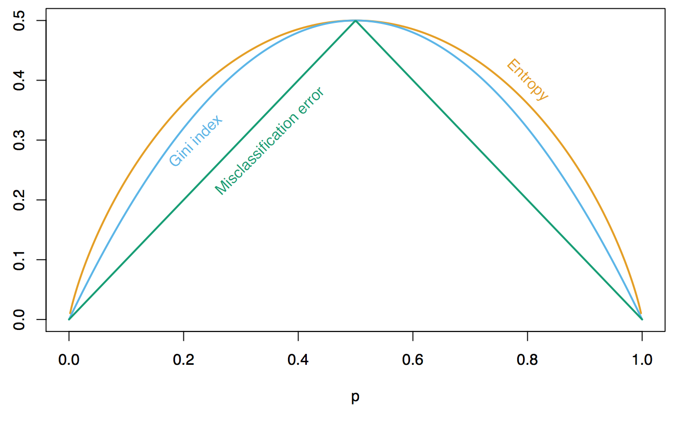

```{r, include=F}
set.seed(42)
knitr::opts_chunk$set(echo = T, error = F, message = F, warning = F)
##rmarkdown::render('09-arboles.Rmd')
```
# Introducción

Hablaremos de un método basado en árboles llamado CART (Classification and Regression Trees). Son una herramienta conceptualmente sencilla, sin embargo, es un método poderoso. A pesar de que hay otros métodos que pueden ganar en poder predictivo, es el fundamento para otros algoritmos, por lo que es importante entender la idea detrás de los árboles. 

La idea básica de un árbol es hacer cortes de variables en distintos puntos para luego decidir cómo clasificar. Los nodos de los árboles pueden interpretarse como puntos de decisión y corte para las variables de entrada del caso que queremos clasificar. 

Los árboles pueden identificar interacciones entre variables sin problemas. 

# Árboles de Clasificación

En CART los árboles de clasificación particionan el espacio de entradas en rectángulos con paralelas a los ejes, y hacen predicciones con modelos sencillos dentro de cada una de esas particiones, e.g. constantes. Una representación posible de los árboles de decisión son los árboles de decisión. Para empezar a entender los árboles CART necesitamos unas cuantas cuestiones: 

1. ¿Cómo hacer las particiones?
2. ¿Cuándo declarar un nodo terminal? ¿Cuando particionar más profundamente? 
3. ¿Cómo hacer predicciones en los nodos terminales? 

## Reglas de partición
Supongamos que tenemos variables de entrada $(X_1,...,X_p)$. Recursivamente, particionamos cada nodo escogiendo entre particiones tales que: 

1. Dependen de una sola variable $X_i$ de entrada. 
2. Si $X_i$ es continua es de la forma $\{X_i\leq c\}\cup \{X_i>c\}$. 
3. Si $X_i$ es categórica, es de la forma $\{X_i\in S\}\cup \{X_i\notin S\}$, donde $S$ es algún subconjunto de las categorías que toma $X_i$.

En cada nodo candidato, escogemos $m_0$ de distintos cortes para perfeccionarlo. 

En cada nodo ¿Cómo escogemos la partición?

El proceso de crecimiento del árbol es recursivo, particionando cada nodo en 2 nodos sucecivos. En cada nodo la partición de escoge de manera 'miope' o local intentando separar las clases de un nodo lo mejor que se pueda. (Ignorando el futuro)


## Medidas de impureza 

Consideremos un nodo $t$ de un árbol $T$, y sean $(p_1(t),...,p_k(t))$ las proporciones de casos de $t$ que caen en cada categoría. La impureza del nodo $t$, estará dada por 
\[i(t)) = \phi(p_1(t),...,p_k(t)),\]
donde $\phi$ es alguna de las siguientes funciones: 

* **Entropía**: 
\[\phi(p_1(t),...,p_k(t))=-\sum_{j=1}^{k} p_j\log(p_j)\]

* **Índice de Gini** 
\[\phi(p_1(t),...,p_k(t))=1-\sum_{j=1}^{k} p_j\]

¿Cómo se ve en un ejemplo de dos dimensiones? 



## Observaciones

Entropía y Gini dan resultados similares y no nos conviene tanto usar el error de clasificación:

\[err = 1 - \max_{j} (p_j(t)),  \]

el error en el que incurrimos al clasificar en el nodo $t$ en la clase más popular de $t$. LA razón es que es menos sensible a la puresa de los nodos, (ver cerca de 0 y 1 ). La razón más importante, es que cuando $k>2$ entropía y gini toman en cuenta lo que pasa en todas las clases y no sólo en la dominante. 

## Impureza 

La impureza $i(T)$ de un árbol $T$ está dado por la impureza promedio de sus nodos terminales: 

\[i(T)= \sum_{t\in T} q(t)i(t)\]

donde $q(t)=\dfrac{N(t)}{N}$, si $N(t)$ es el número de casos de la base que caen en $t$ y $N=\sum_{t\in T}N(t)$

## Regla de Partición

En cada nodo, buscamos entre TODAS las variables $X_i$ y todos los posibles puntos de corte $c$, las que le dan mayor reducción en impureza del árbol resultante. 

Es claro que es una decisión local en cada nodo. Si $t\in T$ y partimos $t=t_1\cup t_2$ Para obtener un nuevo árbol $T'$, entonces: 
\[i(T)-i(T')=i(t)-\dfrac{N(t_1)}{N}i(t_1)- \dfrac{N(t_2)}{N}i(t_2).\]
Buscamos que esta diferencia sea grande. 

En el nodo $t$ resolvemos:
\[\min_{t\rightarrow t_1\cup t_2}\left\{\dfrac{N(t_1)}{N}i(t_1)+ \dfrac{N(t_2)}{N}i(t_2)\right\}. \]

Buscando entre todas las variables $X_j$ y puntos de corte $c$. 

## Crecimiento del Árbol

No usamos un criterio de paro. Seguimos particionando notos hasta que todos los nodos obtenidos sean putos ( a veces se eligen un mínimo de casos para no particionar más un nodo)

## Observaciones

* La idea no es controlar complejidad al hacer crecer el árbol. Esto implica un árbol demasiado grande y probablemente con sobreajuste. El siguiente paso es controlar la complejidad del árbol con la "poda". 
* Algunos métodos relacionados usan criterios para decidir no particionar un nodo. (Calcular un mínimo de reducción en la impureza.) En CART no vamos a hacer eso y un corte puede ser débil, pero más adelante es posible encontrar mejores. 

## Tamaño Correcto de un árbol.

Después del crecimiento del árbol usualmente terminamos con un árbol demasiado grande y el desempeño predictivo de este árbol gigante puede ser malo.

El enforuqe de CART es de escoger el tamaño correcto del árbol mediante una medida del error de entrenamiento, penalizada por el tamaño del árbol (¿Ridge anyone?).

Si $\overline{err}(T)$ es el error de clasificación para un árbol (sobre $\mathcal{L}$, entrenamiento), el costo complejidad de $T$ es: 

\[C_\alpha(T)=\overline{err}(T)+\alpha |T|\]

donde $|T| = \#$ de nodos terminales de $T$, y $\alpha\geq 0$, es un parámetro fijo, ojo entre más grande sea $\alpha$ más se penaliza el tamaño del árbol. 

En principio lo que se nos ocurre es encontrar el árbol óptimo que minimice $C_\alpha(T)$ para cada $\alpha\geq 0$, y luego hacer validación cruzada para escoger el mejor valor de $\alpha$. Esto es infactible, sólo con 5 variables y 5 cortes tenemos $\sim 10^{13}$  árboles (◎ ｡ ◎).

(ﾉﾟ0ﾟ)ﾉ~

Por lo que encontraremos otra manera de hacer esto: 

Sea $\alpha$ fijo. Definimos el árbol $T(\alpha)$, como el árbol que resuelve: 
\[T(\alpha) = arg-\min_{T\leq T_{max}} C_\alpha (T) \]

Es decir, encontramos el subárbol $T_{max}$ que minimiza el costo complejidad. Notar que el árbol obtenido depende de $\alpha$, entre $\alpha$ más grande, $T(\alpha)$ es más chico y viceversa. 

De esta forma encontraremos un 'camino' de regularización para nuestros árboles. Todo va perfecto pero ¿cómo resolvemos el problema de minimización? 

Dado un árbol *maximal*, tenemos que sólo puede tomar un número finito de sub-árboles. Además también sabemos que si $\alpha_1 > \alpha_2$, entonces $|T(\alpha_1)|\leq |T(\alpha_2)|.$ 

La solución al problema es una sucesión anidada de subárboles de $T_{max}$, Esto hace encontrar $T(\alpha)$ más fácil. 

La suceción de árboles se encuentra siguiendo el proceso de la poda de la rama más débil.

¿Más debil?

Supongamos que $T_j$ está dado. $\alpha\geq \alpha_{j-1}$. Aumentamos poco a poco el costo complejidad $\alpha$ y cortamos la primera rama que se nos presente, y con esa obtenemso $T_{j+1}$.

## Cortes Sucedáneos

Cuando construímos árboles, generamos también particiones sucedáneas de cada corte primario. Si hacemos un corte $X_j\geq c$, buscamos cortes con otras variables que reproduzcan lo mejor que se pueda al corte primario. Al mejor de ellos le llamamos 'corte sucedáneo' de $X_j\geq c$, basado en $X_m$ ( si el corte sucedáneo usa la variable $X_m$.) 

Los cortes sucendáneos dan una manera de tratar con los valores faltantes. Si un caso en un nodo $t$, no tiene registrado el valor de $X_j$ y es usado para un corte, lo enviamos al nodo correspondiente según la partición sucedánea del corte de $t$. (Suponiendo que la variable sucedánea si tiene valor, si no, seguimos con las siguientes variables sucedáneas).

Por lo que los árboles CART lidian automáticamente con valores faltantes. 

## Ventajas

* Árboles chicos son muy fáciles de explicar e interpretar.
* Capturan naturalmente interacciones entre variables de entrada.
* Son robustos:
  * Valores atípicos no hacen fallar el método.
  * No es necesario hacer transformaciones de variables.
  * Funcionan con datos faltantes (usando los cortes sucedáneos)
* Ajustan rápidamente y son fáciles de implementar. 

## Desventajas

* Difícilmente capturan entradas lineales.
* En la interpretación muchas veces hay variables que 'enmascaran' a otras. Ojo, que una variable no esté en el árbol no queire decir que no sea importante para predecir. 
* Son inestables ($Var_\alpha(T)$ es generalmente alta), ya que lo construímos de manera miope y basada en cortes locales. Esto produce desempeño predictivo relativamente malo. 
* Para ayudar en estos últimos 2 puntos conviene a veces examinar qué variables compiten para cortar en cada nodo.
* Adicionalmente no son tan apropiados cuando hay variables categóricas con muchos nodos: en estos casos es común subajustar el árbol desde los primeros cortes (por lo agresivo en la búsqueda del corte). 

# Ejercicio

